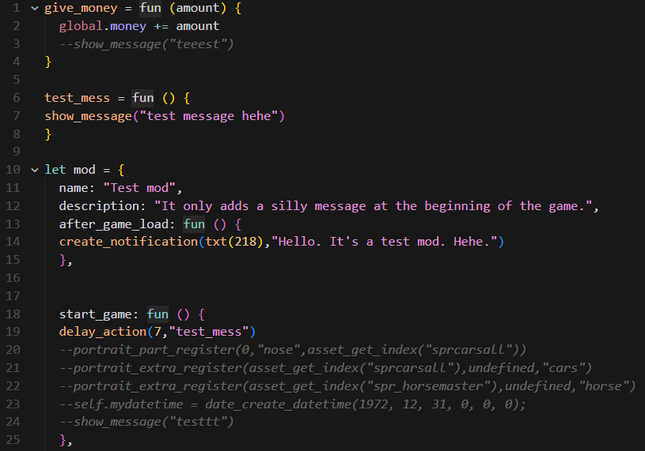

# 🐱 Catspeak Language - VS Code Extension

Syntax highlighting for **Catspeak** (`.meow` files) — the cross-platform modding language for GameMaker games.

Based on [Catspeak](https://github.com/katsaii/catspeak-lang) by Katsaii.

## Features

- ✅ Keywords: `let`, `fun`, `if`, `else`, `while`, `for`, `return`, `break`, `continue`
- ✅ Comments: `--` and `//` line comments
- ✅ Strings: `"..."`, `'...'`, and verbatim `@'...'`
- ✅ Numbers: integers, floats, hex, binary, underscores (`1_000_000`)
- ✅ Logical operators: `and`, `or`, `not`
- ✅ Constants: `true`, `false`, `undefined`, `Pusto`
- ✅ Special variables: `self`, `global`

## Installation

### From VSIX

1. Download the `.vsix` from [Releases](https://github.com/Mattz-CE/catspeak-vscode-highlighting/releases)
2. In VS Code/Cursor: Extensions → `...` → **Install from VSIX**

## License

MIT
